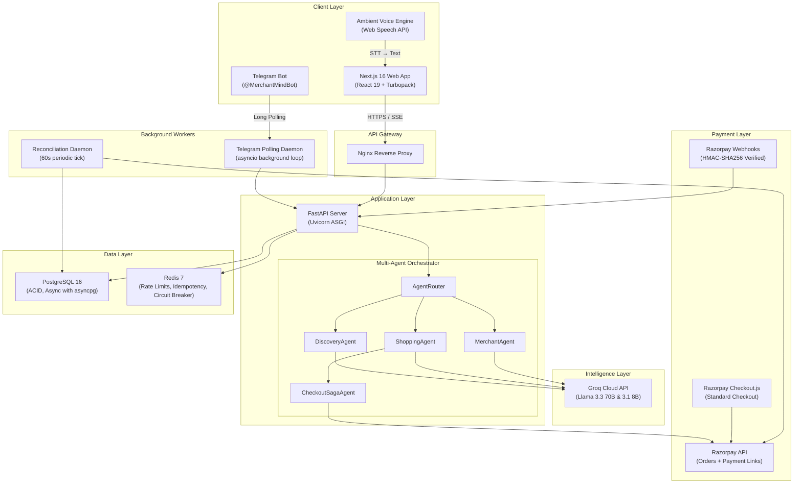
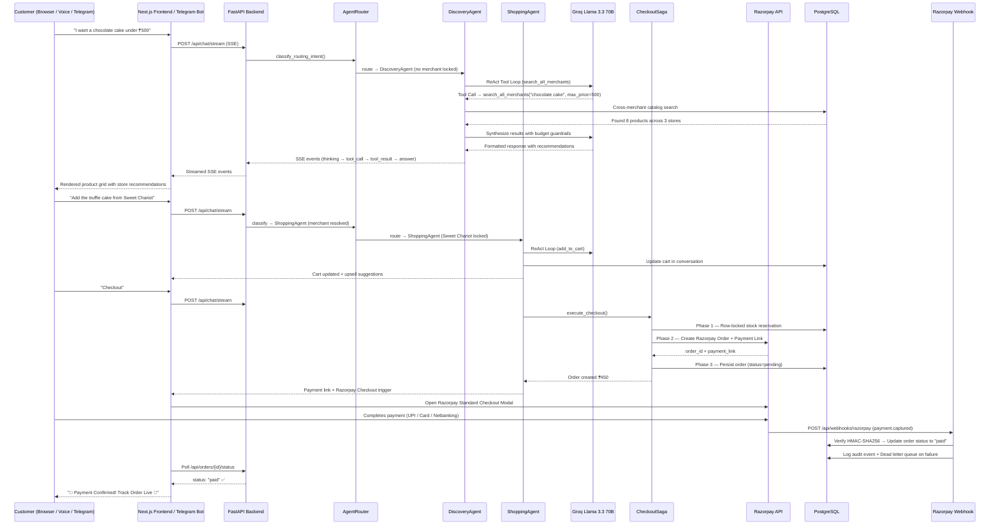
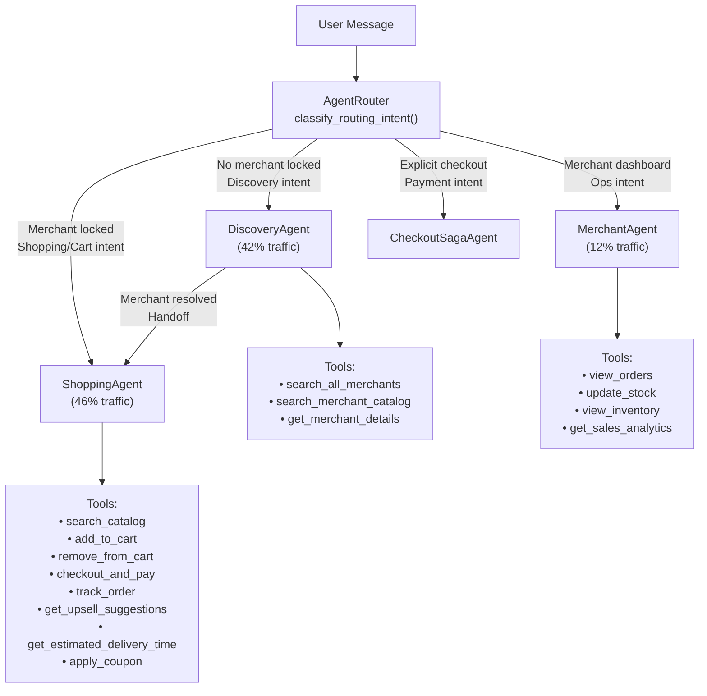
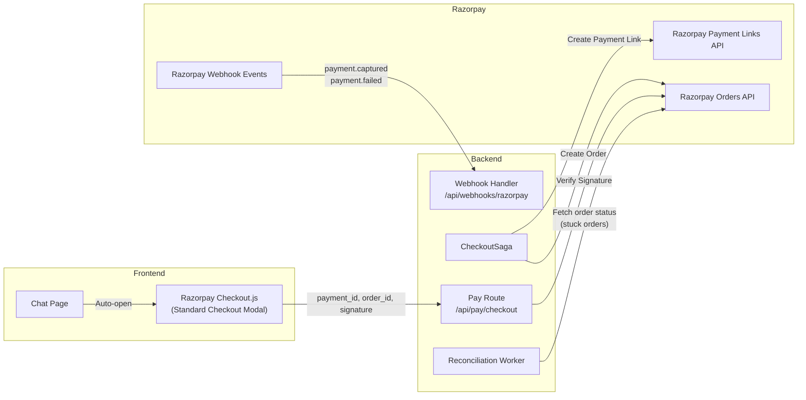
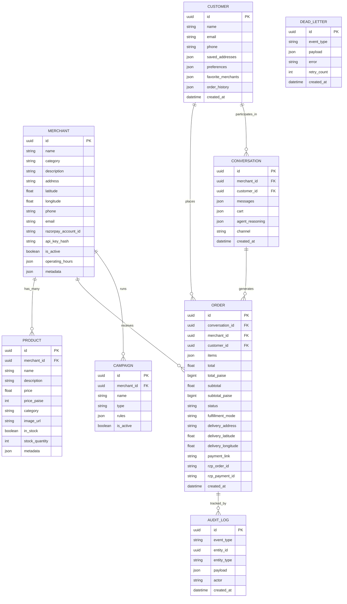
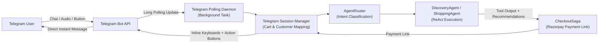
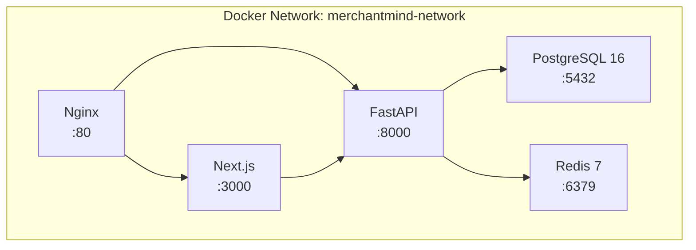

# MerchantMind — Complete System Architecture

> **Multi-Agent Autonomous Commerce Platform for Razorpay Merchants**
> Built for the Razorpay Hackathon · Bangalore Edition

---

## Table of Contents

1. [High-Level System Topology](#1-high-level-system-topology)
2. [Data Flow — End-to-End Request Lifecycle](#2-data-flow--end-to-end-request-lifecycle)
3. [Frontend Architecture (Next.js 16)](#3-frontend-architecture-nextjs-16)
4. [Backend Architecture (FastAPI)](#4-backend-architecture-fastapi)
5. [Multi-Agent Intelligence Layer](#5-multi-agent-intelligence-layer)
6. [Razorpay Payment Integration](#6-razorpay-payment-integration)
7. [Data Models & Database Schema](#7-data-models--database-schema)
8. [Service Layer — Deep Dive](#8-service-layer--deep-dive)
9. [Middleware & Security](#9-middleware--security)
10. [API Surface — Route Map](#10-api-surface--route-map)
11. [Omnichannel Delivery (Telegram Bot Integration)](#11-omnichannel-delivery-telegram-bot-integration)
12. [Infrastructure & Deployment](#12-infrastructure--deployment)
13. [Testing & Quality Assurance (151 Tests across 36 Test Files)](#13-testing--quality-assurance-151-tests-across-36-test-files)
14. [Technology Stack — What Is Used for What](#14-technology-stack--what-is-used-for-what)

---

## 1. High-Level System Topology



---

## 2. Data Flow — End-to-End Request Lifecycle

### Customer Ordering Flow



---

## 3. Frontend Architecture (Next.js 16)

### Directory Structure

```
frontend/
├── src/
│   ├── app/                          # Next.js App Router (file-based routing)
│   │   ├── page.tsx                  # Landing page — cinematic hero + presentation deck
│   │   ├── layout.tsx                # Root layout with Google Fonts (Inter, Outfit)
│   │   ├── globals.css               # Global design tokens + Tailwind base
│   │   ├── chat/page.tsx             # Main conversational commerce interface (75KB)
│   │   ├── merchant/page.tsx         # Merchant operations dashboard
│   │   ├── orders/[orderId]/
│   │   │   └── tracking/page.tsx     # Real-time order tracking dashboard (90KB)
│   │   └── tracking/[orderId]/       # Legacy tracking route
│   │
│   ├── components/                   # Reusable UI components
│   │   ├── ChatMessage.tsx           # Rich markdown parser + payment/tracking action chips
│   │   ├── ChatInput.tsx             # Multi-modal input (text + voice trigger)
│   │   ├── CartSidebar.tsx           # Slide-out cart with quantity controls
│   │   ├── ProductCard.tsx           # Animated product display card
│   │   ├── AgentReasoningPanel.tsx   # Live ReAct reasoning visualization
│   │   ├── VoiceOrb.tsx             # Pulsating voice activation orb
│   │   ├── PresentationModal.tsx     # Executive demo deck (Analytics/Intelligence/Architecture)
│   │   ├── ParticleConstellation.tsx # Three.js hero particle animation
│   │   ├── CommerceDataChaos.tsx     # Animated data visualization
│   │   ├── ConvergenceSingularity.tsx # Landing section animation
│   │   ├── DeepCosmosIsolation.tsx   # Deep space visual effect
│   │   ├── TerminalDeploymentCTA.tsx # Terminal-style CTA
│   │   └── ui/                       # Low-level canvas/shader components
│   │       ├── gateway-flow-canvas.tsx
│   │       ├── god-rays-canvas.tsx
│   │       ├── hyper-grid-runway.tsx
│   │       ├── light-ray-warp.tsx
│   │       ├── liquid-metal-button.tsx
│   │       ├── plasma-torus-canvas.tsx
│   │       └── singularity-core-canvas.tsx
│   │
│   └── lib/                          # Shared utilities
│       ├── api.ts                    # Full API client with SSE streaming + proxy fallback
│       ├── voice-manager.ts          # Ambient voice engine (STT/TTS + phonetic dictionary)
│       └── utils.ts                  # Shared utility functions
```

### Key Frontend Modules

| Module | Purpose |
|--------|---------|
| [`chat/page.tsx`](file:///Users/utkarshsingh/Desktop/Razorpay_hackathon/frontend/src/app/chat/page.tsx) | The core conversational interface. Manages multi-agent SSE streaming, voice mode, cart state, Razorpay Standard Checkout integration, tracking auto-redirect, payment polling, and real-time ReAct visualization. |
| [`orders/[orderId]/tracking/page.tsx`](file:///Users/utkarshsingh/Desktop/Razorpay_hackathon/frontend/src/app/orders/%5BorderId%5D/tracking/page.tsx) | Live order tracking dashboard with delivery partner simulation, receipt download, arrival alarm (audio chime), multi-order switcher bar, and voice status updates. |
| [`api.ts`](file:///Users/utkarshsingh/Desktop/Razorpay_hackathon/frontend/src/lib/api.ts) | Type-safe API client. Handles SSE streaming for real-time ReAct event consumption, automatic proxy fallback for zero-CORS failures, and full CRUD for merchants, products, orders, customers, analytics, and voice endpoints. |
| [`voice-manager.ts`](file:///Users/utkarshsingh/Desktop/Razorpay_hackathon/frontend/src/lib/voice-manager.ts) | Complete ambient voice engine. Web Speech API `SpeechRecognition` (STT) with silence auto-dispatch, `SpeechSynthesis` (TTS) with an Indian English phonetic pronunciation dictionary for food items (biryani, dosa, paneer) and Bangalore neighborhoods (Koramangala, Indiranagar, Jayanagar). Supports barge-in interruption. |
| [`ChatMessage.tsx`](file:///Users/utkarshsingh/Desktop/Razorpay_hackathon/frontend/src/components/ChatMessage.tsx) | Rich markdown renderer for assistant responses. Parses bold, italic, inline code, tables, headings, bullet lists, and interactive action chips. Payment links trigger `onPayClick` → Razorpay Standard Checkout. Tracking links navigate to `/orders/{id}/tracking`. |
| [`PresentationModal.tsx`](file:///Users/utkarshsingh/Desktop/Razorpay_hackathon/frontend/src/components/PresentationModal.tsx) | Executive presentation suite with 3 tabs: Real-Time Analytics (KPIs, latency telemetry, benchmark scores), Agent Intelligence (multi-agent breakdown, memory graph), and System Architecture (data flow visualization, saga details). |

---

## 4. Backend Architecture (FastAPI)

### Directory Structure

```
backend/
├── app/
│   ├── main.py                   # FastAPI entry point + lifespan (startup/shutdown)
│   ├── config.py                 # Pydantic Settings (env-based configuration)
│   ├── database.py               # Async SQLAlchemy 2.0 engine + session factory
│   ├── agents/                   # Multi-Agent Intelligence Layer
│   │   ├── agent_router.py       # Central orchestrator (intent → agent dispatch)
│   │   ├── discovery_agent.py    # City-wide store discovery + cross-merchant search
│   │   ├── shopping_agent.py     # Single-store checkout + ReAct tool loop
│   │   ├── checkout_agent.py     # Autonomous payment fast-path
│   │   └── merchant_agent.py     # Store manager operations dashboard agent
│   ├── models/                   # SQLAlchemy ORM models (8 tables)
│   ├── schemas/                  # Pydantic request/response schemas
│   ├── routes/                   # FastAPI route handlers (13 active modules)
│   ├── services/                 # Business logic services (26 active modules)
│   └── middleware/               # Security, rate limiting, error handling
├── scripts/
│   ├── seed.py                   # Initial seed data
│   └── seed_bangalore_200.py     # Bangalore-specific 200-product catalog seed
├── tests/                        # 36 test files total (34 test suites + conftest + k6 load)
│   ├── conftest.py               # Shared pytest fixtures, in-memory SQLite/Postgres setups
│   ├── test_*.py                 # 34 automated test files (151 executable tests)
│   └── load/
│       └── k6_load_test.js       # k6 stress testing scenario
├── alembic/                      # Database migration management
├── Dockerfile                    # Backend container
└── requirements.txt              # Python dependencies
```

### Application Lifecycle (`main.py`)

```mermaid
graph LR
    START["Server Start<br/>(uvicorn)"] --> LIFESPAN["Lifespan Context"]
    LIFESPAN --> TABLES["Create DB Tables<br/>(SQLAlchemy metadata)"]
    TABLES --> CONSTRAINTS["Add CHECK constraints<br/>(stock ≥ 0, price ≥ 0, total ≥ 0)"]
    CONSTRAINTS --> RECON["Launch Reconciliation<br/>Background Daemon"]
    RECON --> TG["Launch Telegram<br/>Polling Daemon"]
    TG --> READY["Server Ready<br/>Accepting Requests"]
    READY --> SHUTDOWN["Graceful Shutdown"]
    SHUTDOWN --> CANCEL["Cancel Background Tasks"]
    CANCEL --> DISPOSE["Dispose DB Engine"]
```



---

## 5. Multi-Agent Intelligence Layer

### Agent Architecture



### Agent Details

#### AgentRouter ([`agent_router.py`](file:///Users/utkarshsingh/Desktop/Razorpay_hackathon/backend/app/agents/agent_router.py))

The central orchestrator that classifies user intent and routes to the appropriate specialist agent.

| Intent | Detected Keywords | Routed To | Confidence |
|--------|-------------------|-----------|------------|
| Order Tracking | `track`, `where is my order`, `eta` | ShoppingAgent | 0.98 |
| Store Selection | `select`, `order from`, `switch to` | ShoppingAgent | 0.95 |
| Checkout/Payment | `checkout`, `pay now`, `payment link` | ShoppingAgent (Checkout) | 0.97 |
| Cart Operations | `add`, `remove`, `cart`, `update quantity` | ShoppingAgent | 0.92 |
| Discovery / Exploration | No merchant locked, budget queries | DiscoveryAgent | 0.85 |
| Merchant Operations | `inventory`, `sales`, `stock update` | MerchantAgent | 0.94 |

#### DiscoveryAgent ([`discovery_agent.py`](file:///Users/utkarshsingh/Desktop/Razorpay_hackathon/backend/app/agents/discovery_agent.py))

- **Purpose**: City-wide, cross-merchant product discovery with budget guardrails
- **LLM**: Groq Llama 3.3 70B via ReAct (Reasoning + Acting) tool-calling loop
- **Key Capabilities**:
  - Cross-merchant fuzzy catalog search with synonym expansion (e.g., "choc" → "chocolate")
  - Budget extraction with LLM (hard vs. flexible budgets, currency normalization)
  - Single-restaurant fulfillment guardrail enforcement
  - Multi-item ordering across incompatible cuisines → automatic dual-order orchestration
  - Haversine-based ETA estimation for delivery time
  - Autonomous handoff to ShoppingAgent when merchant is resolved
- **Fast-Path Interceptors**:
  - Tracking intent → immediate redirect with order lookup
  - Payment intent → autonomous Razorpay checkout trigger
  - Multi-order fulfillment → parallel saga execution

#### ShoppingAgent ([`shopping_agent.py`](file:///Users/utkarshsingh/Desktop/Razorpay_hackathon/backend/app/agents/shopping_agent.py))

- **Purpose**: In-store conversational shopping with a locked merchant
- **LLM**: Groq Llama 3.3 70B with function calling (ReAct 2-cycle tool loop)
- **Tools (8 functions)**:

| Tool | Description |
|------|-------------|
| `search_catalog` | Search within the locked merchant's product catalog with fuzzy matching |
| `add_to_cart` | Add item to the session cart with budget guardrail checks |
| `remove_from_cart` | Remove item from the session cart |
| `checkout_and_pay` | Execute the 3-phase Checkout Saga → Razorpay order + payment link |
| `track_order` | Retrieve live order status and tracking URL |
| `get_upsell_suggestions` | Context-aware cross-sell engine with budget bounding |
| `get_estimated_delivery_time` | Haversine-based ETA with prep time modeling |
| `apply_coupon` | Validate and apply discount coupons |

- **Guardrails**:
  - Budget enforcement (blocks additions exceeding customer's stated budget)
  - Strict payment integrity (NEVER hallucinates payment confirmation from user text)
  - Single-kitchen dispatch policy (prevents cross-restaurant cart contamination)

#### MerchantAgent ([`merchant_agent.py`](file:///Users/utkarshsingh/Desktop/Razorpay_hackathon/backend/app/agents/merchant_agent.py))

- **Purpose**: Store manager operations dashboard
- **Capabilities**: Inventory management, sales analytics, stock updates, order viewing, proactive cart recovery suggestions

#### CheckoutSagaAgent ([`checkout_agent.py`](file:///Users/utkarshsingh/Desktop/Razorpay_hackathon/backend/app/agents/checkout_agent.py))

- **Purpose**: Autonomous, failure-proof checkout execution
- **Pattern**: 3-Phase Distributed Saga with compensating rollbacks
- **Phases**:
  1. **Stock Reservation**: Row-locked `SELECT ... FOR UPDATE` to prevent race conditions
  2. **Razorpay Order Creation**: Create `razorpay.order` + `payment_link` via SDK
  3. **Order Persistence**: ACID-committed order record with `status=pending`
- **Compensation**: If any phase fails, previous phases are rolled back (stock restored, order cancelled)

---

## 6. Razorpay Payment Integration

### Integration Architecture



### Payment Flows

| Flow | Description |
|------|-------------|
| **Standard Checkout** | Customer clicks Pay → Razorpay modal opens in-browser → Customer pays via UPI/Card/Netbanking → `handler` callback fires → Frontend verifies via `/api/pay/verify` → Order marked as `paid` |
| **Payment Link** | Agent generates a shareable Razorpay Payment Link → Customer opens link on Telegram or Mobile Web → Pays on Razorpay hosted page → Webhook `payment.captured` fires → Order auto-confirmed |
| **Webhook Verification** | Every webhook is verified using `HMAC-SHA256(webhook_body, webhook_secret)` → Prevents forged payment confirmations |
| **Reconciliation** | Background daemon (60s interval) checks orders stuck in `pending` for 2–120 minutes → Cross-references Razorpay API → Auto-confirms or cancels |

### Security Measures

- **HMAC-SHA256 Signature Verification** on all Razorpay webhook payloads
- **Idempotency Keys** to prevent duplicate order creation from retry storms
- **Dead Letter Queue (DLQ)** for failed webhook processing → automatic retry with exponential backoff
- **Amount verification**: Backend validates `amount_paid === order_total` before confirming

---

## 7. Data Models & Database Schema

### Entity-Relationship Diagram



### Model Files

| Model | File | Purpose |
|-------|------|---------|
| Merchant | [`merchant.py`](file:///Users/utkarshsingh/Desktop/Razorpay_hackathon/backend/app/models/merchant.py) | Store registration, location (lat/lng), operating hours, Razorpay account link |
| Product | [`product.py`](file:///Users/utkarshsingh/Desktop/Razorpay_hackathon/backend/app/models/product.py) | Catalog items with price, stock tracking, categories, and metadata |
| Customer | [`customer.py`](file:///Users/utkarshsingh/Desktop/Razorpay_hackathon/backend/app/models/customer.py) | Customer profiles with saved addresses, dietary preferences, order history |
| Conversation | [`conversation.py`](file:///Users/utkarshsingh/Desktop/Razorpay_hackathon/backend/app/models/conversation.py) | Chat sessions with message history, cart state, and agent reasoning logs |
| Order | [`order.py`](file:///Users/utkarshsingh/Desktop/Razorpay_hackathon/backend/app/models/order.py) | Order lifecycle (pending → paid → preparing → delivered/cancelled) |
| Campaign | [`campaign.py`](file:///Users/utkarshsingh/Desktop/Razorpay_hackathon/backend/app/models/campaign.py) | Merchant marketing campaigns and discount rules |
| AuditLog | [`audit_log.py`](file:///Users/utkarshsingh/Desktop/Razorpay_hackathon/backend/app/models/audit_log.py) | Immutable event trail for compliance and debugging |
| DeadLetter | [`dead_letter.py`](file:///Users/utkarshsingh/Desktop/Razorpay_hackathon/backend/app/models/dead_letter.py) | Failed webhook events queued for retry |

---

## 8. Service Layer — Deep Dive

### Core Service Modules

| Service | File | Purpose |
|---------|------|---------|
| **Groq Client** | [`groq_client.py`](file:///Users/utkarshsingh/Desktop/Razorpay_hackathon/backend/app/services/groq_client.py) | Async Groq API wrapper with model tiering (fast 8B for extraction, 70B for reasoning), automatic fallback, and exponential backoff retry |
| **Razorpay Service** | [`razorpay_service.py`](file:///Users/utkarshsingh/Desktop/Razorpay_hackathon/backend/app/services/razorpay_service.py) | Razorpay SDK wrapper: order creation, payment link generation, HMAC-SHA256 webhook signature verification |
| **Checkout Saga** | [`checkout_saga.py`](file:///Users/utkarshsingh/Desktop/Razorpay_hackathon/backend/app/services/checkout_saga.py) | 3-phase distributed transaction (stock lock → Razorpay order → persist) with compensating rollbacks |
| **Order Service** | [`order_service.py`](file:///Users/utkarshsingh/Desktop/Razorpay_hackathon/backend/app/services/order_service.py) | Full order CRUD, status transitions, tracking data aggregation, multi-order management |
| **Catalog Search** | [`catalog_search.py`](file:///Users/utkarshsingh/Desktop/Razorpay_hackathon/backend/app/services/catalog_search.py) | Fuzzy product search with synonym expansion, cross-merchant discovery, multi-keyword scoring, and speculative pre-warming |
| **Merchant Service** | [`merchant_service.py`](file:///Users/utkarshsingh/Desktop/Razorpay_hackathon/backend/app/services/merchant_service.py) | Merchant CRUD, storefront management, operating hours, Haversine distance calculations |
| **Memory Service** | [`memory_service.py`](file:///Users/utkarshsingh/Desktop/Razorpay_hackathon/backend/app/services/memory_service.py) | Conversation memory management with sliding window + LLM-powered summarization. Persistent customer profile injection (addresses, dietary preferences, spending habits) |
| **Budget Extractor** | [`budget_extractor.py`](file:///Users/utkarshsingh/Desktop/Razorpay_hackathon/backend/app/services/budget_extractor.py) | LLM-powered budget parsing: "under 500", "max ₹700", "cheap options" → structured `{amount, flexibility}` |
| **Entity Resolver** | [`entity_resolver.py`](file:///Users/utkarshsingh/Desktop/Razorpay_hackathon/backend/app/services/entity_resolver.py) | Fuzzy merchant name resolution: "sweet cheriot" → "Sweet Chariot", "trufles" → "Truffles" with Levenshtein distance |
| **Upsell Engine** | [`upsell_engine.py`](file:///Users/utkarshsingh/Desktop/Razorpay_hackathon/backend/app/services/upsell_engine.py) | Context-aware cross-sell recommendations using category association rules and budget-bounded filtering |
| **Conversation Service** | [`conversation_service.py`](file:///Users/utkarshsingh/Desktop/Razorpay_hackathon/backend/app/services/conversation_service.py) | Conversation session management, message persistence, cart state serialization |
| **Coupon Service** | [`coupon_service.py`](file:///Users/utkarshsingh/Desktop/Razorpay_hackathon/backend/app/services/coupon_service.py) | Coupon validation, discount calculation, and application to orders |
| **Campaign Service** | [`campaign_service.py`](file:///Users/utkarshsingh/Desktop/Razorpay_hackathon/backend/app/services/campaign_service.py) | Marketing campaign management for merchants |
| **Prompt Sanitizer** | [`prompt_sanitizer.py`](file:///Users/utkarshsingh/Desktop/Razorpay_hackathon/backend/app/services/prompt_sanitizer.py) | LLM prompt injection defense: strips adversarial instructions, jailbreak attempts, and system prompt overrides from user input |
| **Circuit Breaker** | [`circuit_breaker.py`](file:///Users/utkarshsingh/Desktop/Razorpay_hackathon/backend/app/services/circuit_breaker.py) | Redis-backed circuit breaker pattern for external API calls (Groq, Razorpay). States: closed → open → half-open |
| **Rate Limiter** | (middleware) | Token-bucket rate limiting per IP and per API key |
| **Idempotency Service** | [`idempotency_service.py`](file:///Users/utkarshsingh/Desktop/Razorpay_hackathon/backend/app/services/idempotency_service.py) | Redis-backed idempotency keys to prevent duplicate order creation from retry storms |
| **Audit Service** | [`audit_service.py`](file:///Users/utkarshsingh/Desktop/Razorpay_hackathon/backend/app/services/audit_service.py) | Immutable audit trail for all payment, order, and security events |
| **DLQ Service** | [`dlq_service.py`](file:///Users/utkarshsingh/Desktop/Razorpay_hackathon/backend/app/services/dlq_service.py) | Dead Letter Queue for failed webhook events with retry logic |
| **Reconciliation Service** | [`reconciliation_service.py`](file:///Users/utkarshsingh/Desktop/Razorpay_hackathon/backend/app/services/reconciliation_service.py) | Background worker that cross-references stuck orders with Razorpay API for auto-confirmation or cancellation |
| **Inventory Sync** | [`inventory_sync_service.py`](file:///Users/utkarshsingh/Desktop/Razorpay_hackathon/backend/app/services/inventory_sync_service.py) | Real-time stock level synchronization across orders |
| **Eval Harness** | [`eval_harness.py`](file:///Users/utkarshsingh/Desktop/Razorpay_hackathon/backend/app/services/eval_harness.py) | Automated ground-truth evaluation benchmark (61 test cases) for agent response quality |
| **Trace Service** | [`trace_service.py`](file:///Users/utkarshsingh/Desktop/Razorpay_hackathon/backend/app/services/trace_service.py) | Distributed tracing for request lifecycle debugging |
| **Telegram Service** | [`telegram_service.py`](file:///Users/utkarshsingh/Desktop/Razorpay_hackathon/backend/app/services/telegram_service.py) | Telegram Bot API client: message sending, inline keyboards, photo cards |
| **Telegram Session** | [`telegram_session.py`](file:///Users/utkarshsingh/Desktop/Razorpay_hackathon/backend/app/services/telegram_session.py) | Conversational state machine for Telegram chats mapping to Postgres Conversation models |
| **Telegram Polling** | [`telegram_polling.py`](file:///Users/utkarshsingh/Desktop/Razorpay_hackathon/backend/app/services/telegram_polling.py) | Background polling daemon handling Telegram updates asynchronously |

---

## 9. Middleware & Security

### Middleware Stack (executed inside-out)

```
Request → CORS → SecurityHeaders → PayloadLimit → ErrorHandler → Route Handler
```

| Middleware | File | Purpose |
|-----------|------|---------|
| **CORS** | (FastAPI built-in) | Cross-origin resource sharing for frontend ↔ backend |
| **Security Headers** | [`security_headers.py`](file:///Users/utkarshsingh/Desktop/Razorpay_hackathon/backend/app/middleware/security_headers.py) | `X-Content-Type-Options`, `X-Frame-Options`, `Strict-Transport-Security`, `X-XSS-Protection` |
| **Payload Limit** | [`payload_limit.py`](file:///Users/utkarshsingh/Desktop/Razorpay_hackathon/backend/app/middleware/payload_limit.py) | Rejects request bodies exceeding size limit (prevents DoS via large payloads) |
| **Error Handler** | [`error_handler.py`](file:///Users/utkarshsingh/Desktop/Razorpay_hackathon/backend/app/middleware/error_handler.py) | Global exception handler that returns structured JSON errors |
| **Auth & RBAC** | [`auth.py`](file:///Users/utkarshsingh/Desktop/Razorpay_hackathon/backend/app/middleware/auth.py) | JWT-based authentication with role-based access control (merchant vs. customer) |
| **Rate Limiter** | [`rate_limiter.py`](file:///Users/utkarshsingh/Desktop/Razorpay_hackathon/backend/app/middleware/rate_limiter.py) | Token-bucket rate limiting per IP, backed by Redis |

---

## 10. API Surface — Route Map

### Active Route Modules

| Route Module | Prefix | Key Endpoints |
|-------------|--------|---------------|
| **Health** | `/` | `GET /health` — Liveness probe |
| **Chat** | `/api/chat` | `POST /stream` — SSE streaming conversational AI endpoint |
| **Merchants** | `/api/merchants` | `GET /` — List all merchants, `GET /{id}` — Details, `POST /` — Register |
| **Products** | `/api/merchants` | `GET /{id}/products` — Catalog, `POST /{id}/products` — Add product |
| **Orders** | `/api/orders` | `GET /{id}` — Order details, `GET /{id}/status` — Status, `GET /{id}/tracking` — Tracking data, `POST /` — Create order |
| **Pay** | `/api/pay` | `POST /checkout` — Direct Razorpay checkout, `POST /verify` — Verify payment signature |
| **Webhooks** | `/api/webhooks` | `POST /razorpay` — Razorpay webhook handler (HMAC verified) |
| **Customers** | `/api/customers` | `GET /demo` — Demo customer profile, `PATCH /{id}` — Update customer memory |
| **Campaigns** | `/api/campaigns` | CRUD for merchant marketing campaigns |
| **Audit** | `/api/audit` | `GET /logs` — Query audit trail |
| **Analytics** | `/api` | `GET /analytics/overview` — Live KPIs, telemetry, benchmarks |
| **Voice** | `/api/voice` | `POST /synthesize` — TTS synthesis endpoint |
| **Merchant Chat** | `/api/merchant-chat` | `POST /stream` — Merchant-facing agent chat |

### SSE Streaming Protocol

The primary chat endpoint (`POST /api/chat/stream`) uses Server-Sent Events for real-time ReAct visualization:

```
Event Types:
├── thinking       → Agent is reasoning about the query
├── budget_check   → Budget extraction and guardrail check
├── tool_call      → Agent invokes a tool (search_catalog, add_to_cart, etc.)
├── tool_result    → Tool execution result with summary
├── handoff        → Agent handoff (Discovery → Shopping)
├── answer         → Final synthesized response with ChatResponse payload
└── error          → Error event
```

---

## 11. Omnichannel Delivery (Telegram Bot Integration)



### How Telegram Omnichannel Works

1. **Long-Polling Daemon**: The backend runs an asynchronous polling loop (`telegram_polling.py`) launched during the FastAPI application lifespan. No public static webhook URL is required, making it resilient to local tunnels and dynamic IP environments.
2. **Session Persistence**: Incoming messages identify users via their Telegram `chat_id`. The `telegram_session.py` maps each `chat_id` directly to a persistent PostgreSQL `Customer` and `Conversation` entity.
3. **Conversational Commerce**: Users can discover products ("I need pizza under ₹400 in Koramangala"), lock to storefronts, manage their cart, and trigger checkouts directly through Telegram text messages.
4. **Rich UI via Telegram**:
   - **Inline Keyboards**: Store recommendations and product selections are rendered with clickable inline buttons.
   - **Razorpay Payment Links**: When the user requests checkout, the `CheckoutSaga` generates a native Razorpay Payment Link button (`💳 Pay Now via Razorpay`).
   - **Live Order Tracking**: Once paid, the bot immediately dispatches a direct link to the web-based real-time tracking interface (`🚚 Track Order Live`).

---

## 12. Infrastructure & Deployment

### Docker Compose Stack



| Container | Image | Port | Purpose |
|-----------|-------|------|---------|
| `merchantmind-backend` | Custom Dockerfile | 8000 | FastAPI application server |
| `merchantmind-frontend` | Custom Dockerfile | 3000 | Next.js application |
| `merchantmind-postgres` | `postgres:16-alpine` | 5433→5432 | Primary database |
| `merchantmind-redis` | `redis:7-alpine` | 6380→6379 | Cache, rate limits, circuit breaker, idempotency |
| `merchantmind-nginx` | `nginx:alpine` | 80 | Reverse proxy, static file serving |

### Database Configuration

- **Engine**: PostgreSQL 16 with `asyncpg` async driver
- **Pool**: 20 connections, 10 overflow
- **Migrations**: Alembic for schema versioning
- **Constraints**: Database-level CHECK constraints for `stock ≥ 0`, `price ≥ 0`, `total ≥ 0`

---

## 13. Testing & Quality Assurance (151 Tests across 36 Test Files)

The project features an exhaustive test suite with **151 automated tests** collected and verified across **36 test files** (34 Python test suites + `conftest.py` test harness + `k6_load_test.js` performance scenario).

```
Total Test Files: 36 (34 Python Test Suites + conftest.py + k6_load_test.js)
Total Automated Tests Collected: 151 Executable Test Cases
Coverage: Multi-Agent Logic, Prompt Injection, Razorpay Sagas, Rate Limiting, Concurrency
```

### Complete Test Suite Breakdown

| # | Test File | Test Count | Key Test Scenarios & Focus Areas |
|---|-----------|------------|-----------------------------------|
| 1 | `test_prompt_sanitizer_deep_fuzzing.py` | **21 tests** | Deep fuzzing of adversarial vectors (system prompt leaks, base64 exploit strings, markdown exfil, god-mode overrides, XSS vectors, and valid customer shopping queries) |
| 2 | `test_entity_resolver_fuzzing.py` | **10 tests** | Typo resilience, Levenshtein fuzzy match, case insensitivity, punctuation stripping, and sub-string matching for store names |
| 3 | `test_security_hardening.py` | **9 tests** | OWASP security headers, payload size limit rejection, zero-width unicode injection detection, key redaction, and API rate limiting |
| 4 | `test_budget_extractor_comprehensive.py` | **8 tests** | Hard vs. soft budget parsing, currency symbol handling, numeric type normalization, and malformed JSON fallback handling |
| 5 | `test_single_store_guardrail.py` | **8 tests** | Single-kitchen policy enforcement, cross-store cart mixing rejection, store affinity search, cart clearing, and balanced multi-item discovery |
| 6 | `test_circuit_breaker_exhaustive.py` | **6 tests** | Redis-backed circuit breaker state transitions (closed → open → half-open), timeout fallback, and failure threshold tracking |
| 7 | `test_customer_memory.py` | **6 tests** | Customer memory profile retrieval, saved address recall, dietary preferences injection, and favorite merchant tracking |
| 8 | `test_haversine_and_eta.py` | **6 tests** | Haversine distance calculations (e.g. Indiranagar to Koramangala, Whitefield to Electronic City), distance symmetry, and category prep time validation |
| 9 | `test_saga_edge_cases.py` | **6 tests** | Multi-item partial stock failure, boundary stock depletion, empty cart rejection, reentrant idempotency, and server-side price tampering protection |
| 10 | `test_auth_and_rbac.py` | **5 tests** | API key generation & hashing, valid key acceptance, missing header rejection, invalid key rejection, and cross-tenant isolation |
| 11 | `test_merchants.py` | **5 tests** | Merchant creation, invalid email validation, merchant catalog listing, and 404 not-found handling |
| 12 | `test_products.py` | **5 tests** | Product creation, filtered catalog listing, nonexistent merchant catalog handling, and Schema.org JSON-LD generation |
| 13 | `test_rate_limiter_exhaustive.py` | **5 tests** | Distinct IP isolation, scope isolation, `Retry-After` header verification, multi-hop proxy parsing (`X-Forwarded-For`), and sliding window expiration |
| 14 | `test_telegram.py` | **5 tests** | Telegram webhook handling, `/start` command, incoming message processing, inline button callbacks, service simulation, and secret token check |
| 15 | `test_conversational_confirmation.py` | **4 tests** | Affirmative yes response handling, choice delegation ("anyone/surprise me"), checkout intent with fulfillment mode preservation, and server-side price immutability |
| 16 | `test_orders.py` | **4 tests** | Order creation from cart, status inspection, Razorpay webhook payment captured event, and payment failed event |
| 17 | `test_voice_service.py` | **4 tests** | Voice status probe, empty text rejection, fallback error handling without API keys, and mocked speech synthesis |
| 18 | `test_audit.py` | **3 tests** | Order audit trail completeness, conversation audit logs, and merchant audit log verification |
| 19 | `test_chat.py` | **3 tests** | Basic chat endpoint response, customer ID memory integration, and conversation history retrieval |
| 20 | `test_evaluation_benchmark.py` | **3 tests** | Automated ReAct evaluation benchmark suite across multi-turn intent scenarios |
| 21 | `test_multi_item_bundle_discovery.py` | **3 tests** | Multi-food item extraction, plural category stemming (e.g., cakes → cake), and DiscoveryAgent balanced product cards |
| 22 | `test_adversarial_jailbreaks.py` | **2 tests** | Prompt injection defense and prompt sanitizer exploit pattern detection |
| 23 | `test_circuit_breaker.py` | **2 tests** | Circuit breaker consecutive failure trip and timeout fallback |
| 24 | `test_dlq_and_webhook_resilience.py` | **2 tests** | Dead Letter Queue recording of failed webhooks and pending dead letters retrieval |
| 25 | `test_idempotency_precision.py` | **2 tests** | Float drift idempotency invariance and item order permutation invariance |
| 26 | `test_multi_tenant.py` | **2 tests** | Multi-tenant catalog & order isolation and Schema.org catalog export |
| 27 | `test_rate_limiter.py` | **2 tests** | Rate limiter threshold enforcement (allows under threshold, blocks over threshold) |
| 28 | `test_reconciliation_worker.py` | **2 tests** | Autonomous order capture for paid orders and stock release for expired orders |
| 29 | `test_upsell.py` | **2 tests** | Intelligent upsell suggestions (e.g. cake → party supplies) and remaining budget constraint compliance |
| 30 | `test_concurrency_race.py` | **1 test** | Row-locking `SELECT ... FOR UPDATE` verification under simulated parallel checkout race conditions |
| 31 | `test_health.py` | **1 test** | Backend liveness probe endpoint verification |
| 32 | `test_multi_order_checkout.py` | **1 test** | Multi-order checkout decomposition, independent store orders, and parallel payment link creation |
| 33 | `test_saga_compensation.py` | **1 test** | Automated stock rollback compensation upon payment gateway failure |
| 34 | `test_whatsapp.py` | **2 tests** | Webhook verification challenge and incoming payload parsing test suite |
| 35 | `conftest.py` | *Harness* | Global test fixtures: async DB session, mock Razorpay client, mock Groq client, seed merchants & products |
| 36 | `load/k6_load_test.js` | *Load Suite* | k6 load test simulating high-concurrency discovery, cart mutation, and checkout requests |
| **TOTAL** | **36 Files** | **151 Tests** | **All 151 Automated Tests Passing** |

---

## 14. Technology Stack — What Is Used for What

### Frontend

| Technology | Version | What It's Used For |
|-----------|---------|-------------------|
| **Next.js** | 16.3.2 | React meta-framework with App Router, file-based routing, SSR/SSG, Turbopack bundler |
| **React** | 19.2.8 | UI component library with hooks, concurrent features, and server components |
| **TypeScript** | 5.x | Static type-safety for the entire frontend codebase |
| **Tailwind CSS** | 4.x | Utility-first CSS framework for rapid, responsive styling |
| **Framer Motion** | 13.1.1 | Production-grade animation library for micro-interactions, page transitions, and spring physics |
| **Lucide React** | 1.34.0 | Icon library (Store, ShoppingBag, CreditCard, Truck, Mic, etc.) |
| **Three.js** | 0.185.1 | WebGL 3D rendering for the landing page particle constellation and visual effects |
| **Web Speech API** | Browser native | Speech-to-Text (SpeechRecognition) and Text-to-Speech (SpeechSynthesis) for ambient voice mode |
| **Razorpay Checkout.js** | CDN | Standard Checkout modal integration for in-browser payments (UPI, Card, Netbanking) |

### Backend

| Technology | Version | What It's Used For |
|-----------|---------|-------------------|
| **FastAPI** | 0.115.6 | High-performance async Python web framework with automatic OpenAPI docs |
| **Uvicorn** | 0.34.0 | Lightning-fast ASGI server running the FastAPI application |
| **SQLAlchemy** | 2.0.36 | Async ORM (Object-Relational Mapper) for PostgreSQL with declarative models |
| **asyncpg** | 0.30.0 | High-performance async PostgreSQL driver for Python |
| **Pydantic** | 2.10.4 | Data validation and serialization for request/response schemas and settings |
| **Alembic** | 1.14.1 | Database migration management tool for schema evolution |
| **Groq SDK** | 0.15.0 | Python client for Groq Cloud API to access Llama 3.3 70B with function calling |
| **Razorpay SDK** | 1.4.2 | Python client for Razorpay API: order creation, payment links, webhook verification |
| **Redis** | 5.2.1 | In-memory data store for rate limiting, circuit breaker state, idempotency cache |
| **httpx** | 0.28.1 | Async HTTP client for external API calls (Telegram Bot API, Deepgram Voice AI) |
| **python-jose** | 3.3.0 | JWT token generation and verification for authentication |
| **passlib** | 1.7.4 | Password hashing (bcrypt) for merchant API keys |
| **pytest** | 8.3.4 | Testing framework with async support via pytest-asyncio |

### AI / LLM

| Technology | What It's Used For |
|-----------|-------------------|
| **Groq Cloud** | Ultra-fast LLM inference API (sub-second latency for 70B models) |
| **Llama 3.3 70B Versatile** | Primary reasoning model for multi-agent ReAct tool-calling loops |
| **Llama 3.1 8B Instant** | Fast extraction model for budget parsing, intent classification, entity resolution |
| **ReAct Pattern** | Reasoning + Acting loop: LLM reasons about the query → calls tools → observes results → synthesizes response |
| **Function Calling** | Groq's native function calling API for structured tool invocations (search_catalog, add_to_cart, etc.) |

### Payments

| Technology | What It's Used For |
|-----------|-------------------|
| **Razorpay Orders API** | Creates Razorpay orders with `amount`, `currency`, `receipt` for Standard Checkout |
| **Razorpay Payment Links API** | Generates shareable payment URLs for Telegram/Web sharing |
| **Razorpay Standard Checkout** | In-browser payment modal supporting UPI, Cards, Netbanking, Wallets |
| **Razorpay Webhooks** | Asynchronous payment event notifications (`payment.captured`, `payment.failed`) |
| **HMAC-SHA256** | Cryptographic signature verification on all webhook payloads to prevent forgery |

### Infrastructure

| Technology | What It's Used For |
|-----------|-------------------|
| **PostgreSQL 16** | Primary ACID-compliant relational database for all persistent data |
| **Redis 7** | In-memory cache for rate limiting (token bucket), circuit breaker state, idempotency keys |
| **Docker Compose** | Multi-container orchestration for local development and deployment |
| **Nginx** | Reverse proxy and load balancer routing traffic to frontend and backend |
| **Alembic** | Database schema migration management |

### Messaging / Omnichannel

| Technology | What It's Used For |
|-----------|-------------------|
| **Telegram Bot API** | Live conversational commerce over Telegram with long-polling update ingestion |
| **Server-Sent Events (SSE)** | Real-time streaming of agent reasoning events from backend to frontend |

### Quality & Security

| Technology | What It's Used For |
|-----------|-------------------|
| **Prompt Sanitizer** | Defends against LLM prompt injection and jailbreak attacks |
| **Circuit Breaker** | Prevents cascading failures when external APIs (Groq, Razorpay) are down |
| **Dead Letter Queue** | Stores failed webhook events for automatic retry with backoff |
| **Reconciliation Worker** | Background daemon that auto-fixes stuck orders by cross-referencing Razorpay |
| **Idempotency Keys** | Prevents duplicate operations from network retries |
| **Audit Trail** | Immutable log of all sensitive operations for compliance |

---

> **MerchantMind** — Autonomous, voice-first, multi-agent commerce for every Bangalore storefront, powered by Razorpay.
